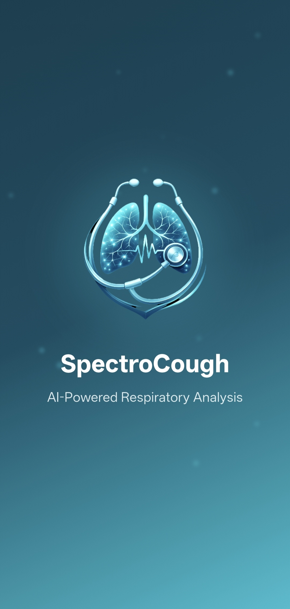
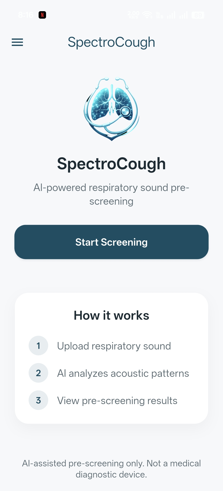
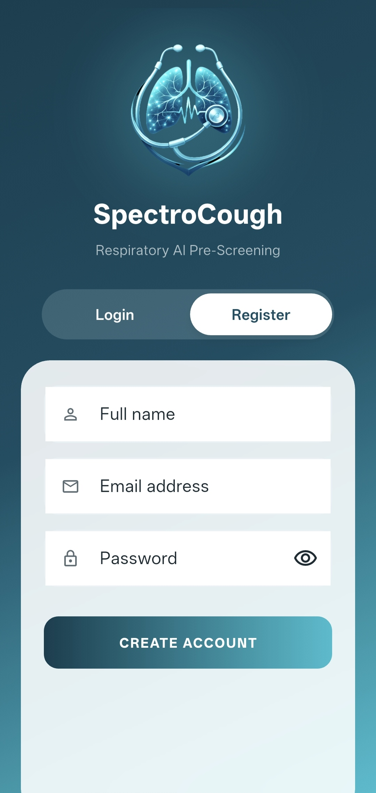
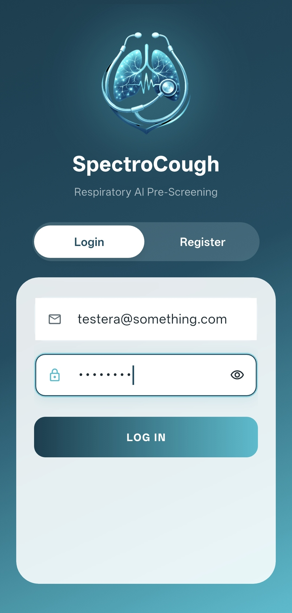
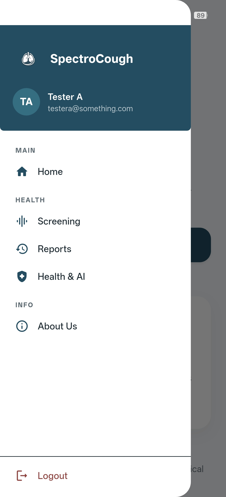
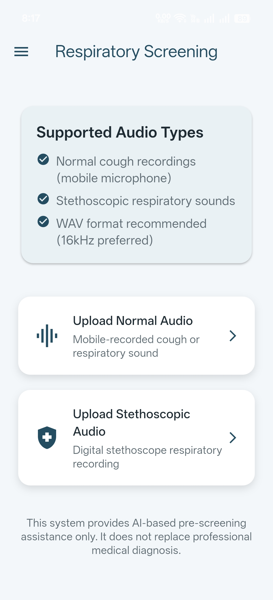
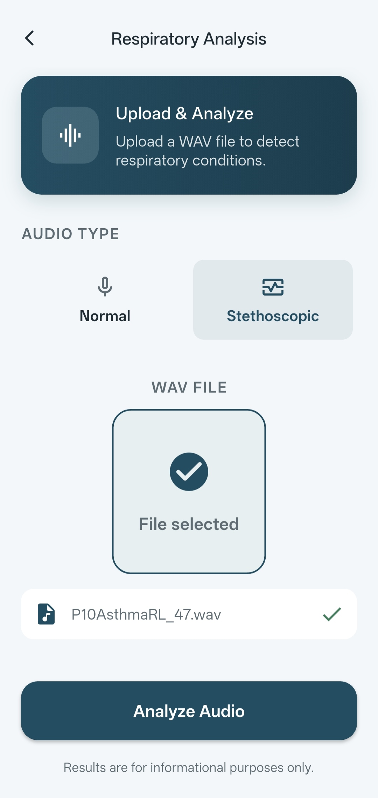
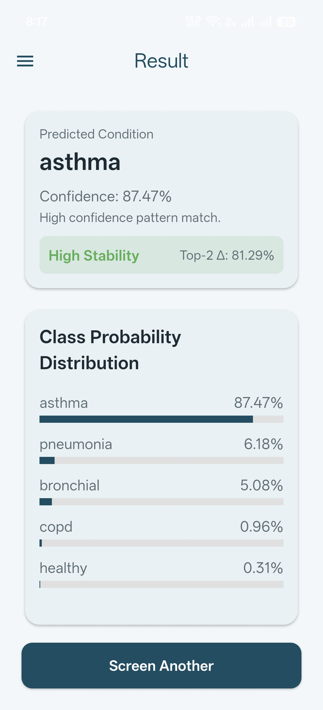
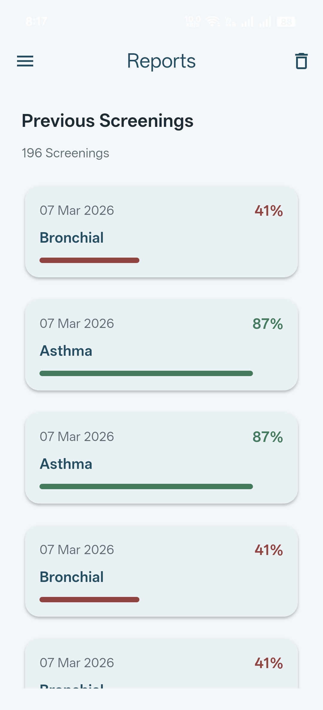
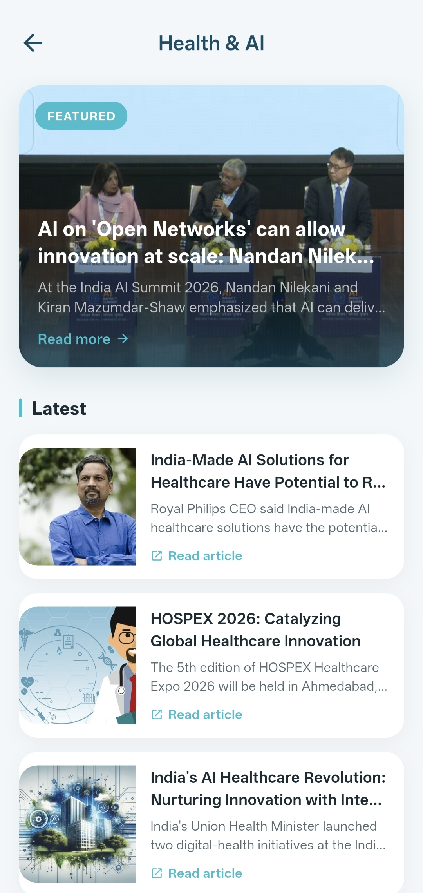

# SpectroCough


SpectroCough is an AI-powered respiratory screening system that analyzes cough audio recordings and predicts possible respiratory conditions using a machine learning model.

The system consists of a Flutter mobile application connected to a FastAPI backend that runs an audio processing and machine learning inference pipeline.

The platform allows users to upload cough recordings, receive predictions with confidence scores, track prediction history, and access health related educational content.

---

# Features

### AI Prediction
- Upload cough audio samples
- Automated preprocessing and feature extraction
- Machine learning inference
- Confidence scoring
- Prediction stability margin

### User System
- User registration and login
- JWT based authentication
- Secure API communication

### Health Tools
- AI assisted respiratory screening
- Prediction history and reports
- Educational health articles

### System Monitoring
- Health check endpoints
- Model information endpoint
- Rate limited prediction API

---

# System Architecture

```
Flutter Mobile App
        ↓
FastAPI Backend
        ↓
Audio Preprocessing Pipeline
        ↓
Feature Extraction
        ↓
Feature Scaling
        ↓
Keras Machine Learning Model
        ↓
Prediction + Confidence
        ↓
PostgreSQL Database
        ↓
Response Returned to App
```

---

# Tech Stack

## Frontend
- Flutter
- Dart
- Material UI components
- REST API integration
- WebView for article viewing

## Backend
- FastAPI
- SQLAlchemy
- PostgreSQL
- JWT Authentication
- SlowAPI rate limiting

## Machine Learning
- TensorFlow / Keras model (.keras)
- Feature scaler (.pkl)
- Custom audio preprocessing pipeline

---

# Backend Setup

Create virtual environment

```bash
python -m venv venv
```

Activate environment

```bash
venv\Scripts\activate
```

Install dependencies

```bash
pip install -r requirements.txt
```

Run the API server

```bash
uvicorn app.main:app --reload
```

Server runs at

```
http://localhost:8000
```

API documentation

```
http://localhost:8000/docs
```

---

# Frontend Setup

Navigate to the Flutter project directory and install dependencies.

```bash
flutter pub get
```

Run the application

```bash
flutter run
```

Ensure the backend server is running before testing prediction features.

---

# Mobile Screenshots

<p align="center">
  
  
  
</p>

<p align="center">
  
  
  
</p>

<p align="center">
  
  
  
</p>

<p align="center">
  
</p>

---

# Frontend Architecture

The Flutter application follows a modular structure separating UI, services, models, and shared components.

### Screens
- Splash Screen
- Login / Authentication Screens
- Home Screen
- Upload Screen
- Result Screen
- Reports Screen
- Health AI Screen
- Article Viewer Screen
- About Screen

### UI Components

Reusable widgets include

- Navigation drawer
- Loading overlays
- Authentication components
- Animated UI indicators

### Services Layer

Frontend services manage communication with backend APIs.

**api_service.dart**

Handles

- Authentication
- Prediction requests
- Fetching prediction history

**news_service.dart**

Handles

- Retrieving health related articles

### Models

Frontend models represent API responses.

- `prediction_result.dart`
- `news_article.dart`

These models convert JSON API responses into strongly typed Dart objects.

---

# Folder Structure

## Backend

```
spectrocough_backend/
│
├── requirements.txt
├── models/
│   ├── spectrocough_v1_baseline.keras
│   └── acoustic_scaler.pkl
│
└── app/
    ├── main.py
    ├── database.py
    ├── db_models.py
    ├── security.py
    ├── core/
    ├── routes/
    ├── schemas/
    ├── services/
    └── ml_pipeline/
```

## Frontend

```
lib/
├── app.dart
├── main.dart
│
├── widgets/
│   ├── app_drawer.dart
│   └── loading_overlay.dart
│
├── theme/
│   ├── app_colors.dart
│   └── app_text_styles.dart
│
├── services/
│   ├── api_service.dart
│   └── news_service.dart
│
├── screens/
│   ├── about_screen.dart
│   ├── article_webview_screen.dart
│   ├── health_ai_screen.dart
│   ├── home_screen.dart
│   ├── login_screen.dart
│   ├── reports_screen.dart
│   ├── result_screen.dart
│   ├── screening_screen.dart
│   ├── splash_screen.dart
│   ├── upload_screen.dart
│   └── auth/
│       ├── animated_auth_screen.dart
│       └── widgets/
│           ├── auth_shared_widgets.dart
│           ├── bubble_indicator.dart
│           ├── sign_in_form.dart
│           └── sign_up_form.dart
│
└── models/
    ├── news_article.dart
    └── prediction_result.dart
```

---

# API Endpoints

## Authentication

```
POST /auth/register
POST /auth/login
GET /auth/me
```

## Prediction

```
POST /predict
```

Request

- Multipart audio file (.wav)
- audio_type

Response

- Predicted condition
- Confidence score
- Prediction stability margin
- Model version
- Optional warnings

---

## Prediction History

```
GET /predictions
DELETE /predictions
```

---

## System Endpoints

```
GET /health
GET /model-info
```

---

# Future Improvements

- Model version tracking
- Monitoring dashboards
- Deployment automation
- Docker containerization
- Expanded datasets
- Clinical validation

---

# License

This project was developed for academic and research purposes.
